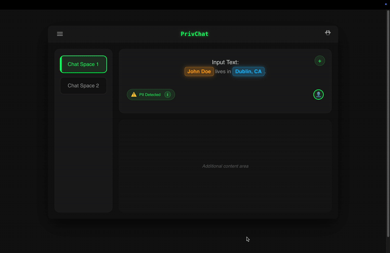

# PrivChat - PII Detection Web Application

A privacy-focused full-stack web application that detects Personally Identifiable Information (PII) in text using advanced NLP techniques and provides AI-powered suggestions for safer communication using Google's Gemini API.



## 🌐 Live Demo

- **Frontend:** [https://llm-task-phi.vercel.app](https://llm-task-phi.vercel.app)
- **Backend API:** [https://llm-task.onrender.com](https://llm-task.onrender.com)
- **API Documentation:** [https://llm-task.onrender.com/docs](https://llm-task.onrender.com/docs)

> **Note:** The live demo is hosted on free tiers, so it may take a few seconds to wake up after inactivity. Make sure the backend is running before testing the frontend.

## ✨ Features

- **🔍 PII Detection**: Uses spaCy's Named Entity Recognition to identify personal information including:
  - Names (PERSON)
  - Organizations (ORG)  
  - Locations (GPE)
  - Dates (DATE)
  - Money amounts (MONEY)
  - Phone numbers and other sensitive data
  
- **🤖 AI-Powered Suggestions**: Integrates with Google's Gemini 2.0 Flash model to provide:
  - Privacy-conscious text rewriting
  - Maintains original meaning while protecting sensitive data
  - Natural language output with professional tone

- **🎨 Interactive UI**: Modern, Mac-style interface featuring:
  - Real-time PII highlighting with pulsing visual effects
  - Expandable details panel showing all detected entities
  - Confidence scores for each detected PII element
  - Responsive design with smooth animations
  - Color-coded entity categories

- **⚡ Production Ready**: Fully deployed with professional infrastructure

## 🏗️ Architecture

### Backend (FastAPI)

- **Framework**: FastAPI with production-grade CORS configuration
- **NLP**: spaCy with `en_core_web_sm` model for entity recognition
- **AI Integration**: Google Gemini 2.0 Flash API for text rewriting
- **Confidence Scoring**: Custom algorithm based on entity type, length, and context
- **Deployment**: Render.com with auto-scaling and health monitoring

### Frontend (Vanilla JavaScript)

- **Design**: Mac-style window interface with sidebar navigation
- **Highlighting**: Dynamic PII highlighting with color-coded categories
- **Interactions**: Smooth animations and responsive layout
- **Accessibility**: Keyboard navigation and screen reader support
- **Deployment**: Vercel with global CDN and instant deployment

## 🚀 Quick Start (Try It Now!)

**Just visit:** [https://llm-task-phi.vercel.app](https://llm-task-phi.vercel.app)

1. Click the **"+"** button to enter input mode
2. Type or paste text containing PII (e.g., "Hi, I'm John Doe from Google in New York")
3. Click **"Send"** to analyze
4. View the AI-powered privacy-safe rewrite
5. Click **"i"** to see detailed PII analysis

## 💻 Local Development Setup

### Prerequisites

- **Python 3.8+** 
- **Google AI Studio API Key** ([Get one here](https://aistudio.google.com/apikey))

### 1. Clone the Repository

```bash
git clone https://github.com/tanush-g/llm-task.git
cd llm-task
```

### 2. Backend Setup

```bash
cd backend

# Create virtual environment (recommended)
python -m venv venv
source venv/bin/activate  # On Windows: venv\Scripts\activate

# Install Python dependencies
pip install -r requirements.txt

# Download spaCy English model
python -m spacy download en_core_web_sm

# Configure API key
cp .env.example .env
# Edit .env and add your GEMINI_API_KEY
```

### 3. Start Development Servers

```bash
# Terminal 1: Start backend
cd backend
python main.py
# Backend runs on http://localhost:8000

# Terminal 2: Serve frontend
cd frontend
python -m http.server 3000
# Frontend available at http://localhost:3000
```

### 4. Access Local Application

Navigate to `http://localhost:3000` in your web browser.

## 🎯 How to Use

1. **Input Text**: Click the "+" button to toggle input mode
2. **Analyze**: Type or paste text containing potential PII and click "Send"
3. **Review Results**: 
   - View the AI-rewritten privacy-safe version
   - See highlighted PII elements in the original text
   - Click the "i" button to view detailed PII analysis with confidence scores
4. **Privacy Protection**: Use the rewritten version for safer communication

## 📡 API Documentation

### Live API Endpoints

- **Base URL**: [https://llm-task.onrender.com](https://llm-task.onrender.com)
- **Interactive Docs**: [https://llm-task.onrender.com/docs](https://llm-task.onrender.com/docs)

### `POST /analyze`

Analyzes text for PII and generates a privacy-safe rewrite using Gemini AI.

**Request Body:**
```json
{
  "text": "Hi, I'm John Smith from Acme Corp. Call me at 555-123-4567."
}
```

**Response:**
```json
{
  "entities": [
    {
      "text": "John Smith",
      "label": "PERSON",
      "confidence": 0.95,
      "start": 8,
      "end": 18
    },
    {
      "text": "Acme Corp",
      "label": "ORG",
      "confidence": 0.85,
      "start": 24,
      "end": 33
    }
  ],
  "ai_response": "Hello! I'm a professional from a technology company. Please feel free to contact me.",
  "original_text": "Hi, I'm John Smith from Acme Corp. Call me at 555-123-4567.",
  "sanitized_text": "Hi, I'm [Name] from [Company]. Call me at [Phone]."
}
```

### `GET /health`

Health check endpoint to verify service status.

**Response:**
```json
{
  "status": "healthy",
  "spacy_loaded": true,
  "gemini_configured": true,
  "model": "gemini-2.0-flash"
}
```

## 🔧 Configuration & Deployment

### Environment Variables

```env
GEMINI_API_KEY=your_gemini_api_key_here
```

### Production Architecture

- **Backend**: Deployed on [Render.com](https://render.com) with auto-scaling
- **Frontend**: Deployed on [Vercel](https://vercel.com) with global CDN
- **Database**: None required (stateless application)
- **AI Model**: Google Gemini 2.0 Flash via API

### Model Configuration

The Gemini API is configured with optimal settings for privacy-focused text rewriting:

- **Temperature**: 0.3 (for consistent, reliable results)
- **Max tokens**: 100 (concise responses)
- **Top-p**: 0.8 (balanced creativity and coherence)

## 🛠️ Development

### Project Structure

```
llm-task/
├── backend/
│   ├── main.py              # FastAPI application with Gemini integration
│   ├── requirements.txt     # Python dependencies
│   ├── .env                 # Environment variables (API key)
│   ├── setup.sh            # Setup script for local development
│   └── test_config.py      # Configuration testing utility
├── frontend/
│   └── index.html          # Single-page application
├── demo.gif                # Demo animation
├── DEPLOYMENT_README.md    # Deployment documentation
└── README.md               # This file
```

### Adding New Entity Types

To support additional PII types, modify the entity filter in `backend/main.py`:

```python
if ent.label_ in ["PERSON", "ORG", "GPE", "DATE", "MONEY", "CARDINAL", "YOUR_NEW_TYPE"]:
```

### Customizing the UI

The frontend uses a single HTML file with embedded CSS and JavaScript:

- **Color schemes**: Modify CSS custom properties
- **Animation timing**: Adjust CSS keyframe durations  
- **Layout breakpoints**: Update responsive design rules

## 🔍 Testing

### Manual Testing

```bash
# Test health endpoint
curl https://llm-task.onrender.com/health

# Test analyze endpoint
curl -X POST "https://llm-task.onrender.com/analyze" \
     -H "Content-Type: application/json" \
     -d '{"text": "Hi, I am John Doe and I work at Google in Mountain View."}'
```

### Example API Usage

```python
import requests

# Analyze text for PII
response = requests.post(
    "https://llm-task.onrender.com/analyze",
    json={"text": "Hi, I'm Jane Smith from Microsoft in Seattle. Call me at (555) 123-4567."}
)

data = response.json()
print("Detected entities:", data["entities"])
print("AI rewrite:", data["ai_response"])
```

## 🚨 Troubleshooting

### Common Issues

#### 1. API Connection Errors
- **Issue**: Frontend can't connect to backend
- **Solution**: Check CORS configuration and ensure backend is running
- **Live Status**: Visit [https://llm-task.onrender.com/health](https://llm-task.onrender.com/health)

#### 2. Gemini API Errors
- **Issue**: "API key not configured" or quota exceeded
- **Solution**: Verify API key in environment variables or check quota limits
- **Get API Key**: [Google AI Studio](https://aistudio.google.com/apikey)

#### 3. spaCy Model Errors
- **Issue**: "spaCy model not found"
- **Local Solution**: `python -m spacy download en_core_web_sm`
- **Production**: Model is automatically installed during deployment

#### 4. Cold Start Delays
- **Issue**: First request takes 30+ seconds
- **Explanation**: Render free tier apps sleep after inactivity
- **Solution**: Upgrade to paid tier for instant responses

### Performance Notes

- **Cold Start**: First request after inactivity may take 30-60 seconds
- **Response Time**: Subsequent requests typically respond in 2-5 seconds
- **Rate Limiting**: No artificial limits, bounded by Gemini API quotas

## 🔒 Security & Privacy

### Data Handling
- **No Data Storage**: Application is stateless, no user data is persisted
- **API Security**: All API calls use HTTPS encryption
- **CORS Protection**: Configured to allow specific domains only
- **Input Validation**: All user inputs are validated and sanitized

### Privacy Considerations
- **PII Detection**: Identifies sensitive information locally using spaCy
- **AI Processing**: Text is sent to Google Gemini API for rewriting
- **No Logging**: Sensitive data is not logged or stored
- **Minimal Data**: Only necessary text is sent to external APIs

## 🚀 Deployment Details

### Backend (Render.com)
- **URL**: https://llm-task.onrender.com
- **Auto-deployment**: Triggered by GitHub commits
- **Environment**: Python 3.9+ with automatic dependency management
- **Scaling**: Auto-scales based on demand (free tier limitations apply)

### Frontend (Vercel)
- **URL**: https://llm-task-phi.vercel.app
- **CDN**: Global edge network for fast loading
- **Auto-deployment**: Triggered by GitHub commits
- **Performance**: Optimized static asset delivery

## 🤝 Contributing

We welcome contributions to improve PrivChat! Here's how to get started:

### Development Workflow

1. **Fork the repository**
2. **Create a feature branch**
   ```bash
   git checkout -b feature/amazing-feature
   ```
3. **Make your changes**
4. **Test thoroughly** (both locally and against production API)
5. **Submit a pull request**

### Areas for Contribution

- **🎨 UI/UX improvements**: Enhanced animations, better responsive design
- **🔍 PII Detection**: Support for additional entity types or languages
- **⚡ Performance**: Caching strategies, faster load times
- **🛡️ Security**: Additional validation, rate limiting
- **📚 Documentation**: Improved examples, tutorials

## 📄 License

This project is created for educational and demonstration purposes. 

## 🙏 Acknowledgments

- **[spaCy](https://spacy.io/)**: For excellent NLP capabilities and entity recognition
- **[Google Gemini](https://ai.google.dev/)**: For powerful AI text generation
- **[FastAPI](https://fastapi.tiangolo.com/)**: For the robust, high-performance backend framework
- **[Render](https://render.com/)**: For reliable backend hosting
- **[Vercel](https://vercel.com/)**: For fast frontend deployment and CDN

## 📞 Support

- **Live Demo**: [https://llm-task-phi.vercel.app](https://llm-task-phi.vercel.app)
- **API Status**: [https://llm-task.onrender.com/health](https://llm-task.onrender.com/health)
- **Issues**: [GitHub Issues](https://github.com/tanush-g/llm-task/issues)

---

**⚡ Quick Start**: Visit the [live demo](https://llm-task-phi.vercel.app) to try PrivChat immediately, or follow the [local setup guide](#-local-development-setup) to run it on your machine!
